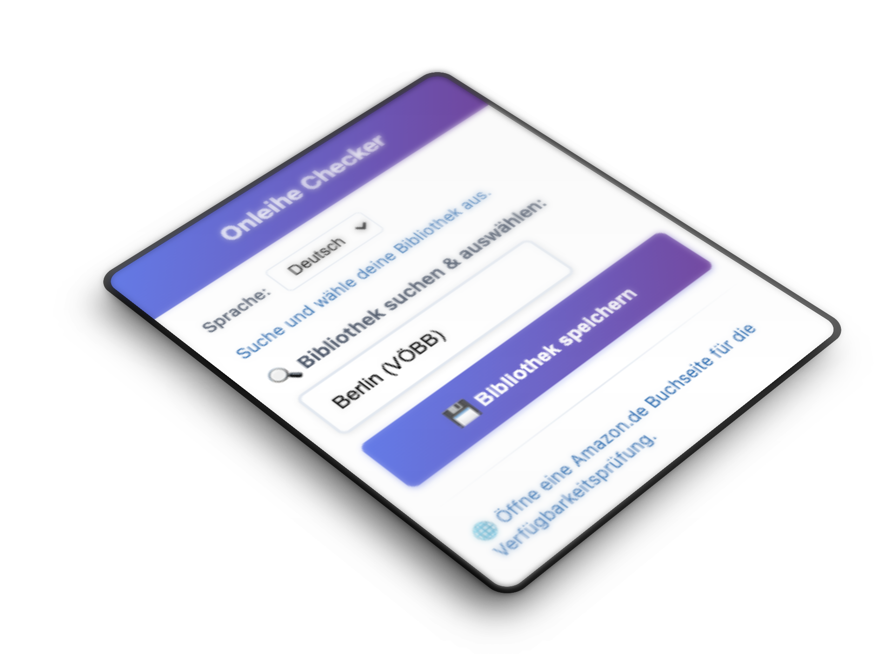
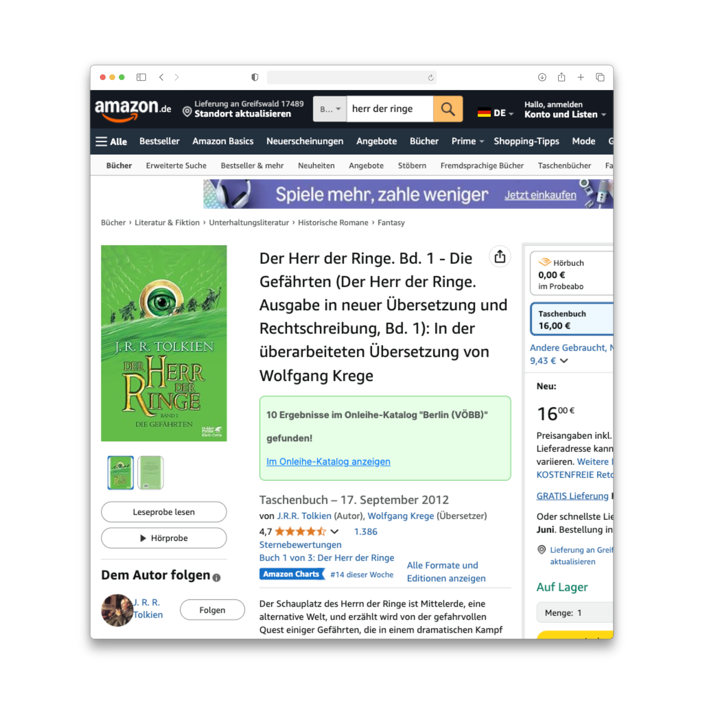

# Onleihe Scraper & Checker


A Python web scraper and Chrome extension for German digital library services (Onleihe). This project consists of two main components:

1. **Web Scraper**: Extracts library information from official Onleihe help pages
2. **Chrome Extension**: Checks book availability in your local Onleihe library while browsing Amazon

## 🚀 Features

### Web Scraper
- Scrapes German Onleihe libraries from the official help pages
- Handles cookie banners and dynamic content loading
- Exports clean, structured library data to JSON
- Automatic URL cleaning (removes frontend paths and parameters)
- **Note**: Currently focuses on German libraries only

### Chrome Extension
- Seamlessly integrates with Amazon.de product pages
- Real-time availability checking in your selected library
- Clean, responsive popup interface for library selection
- Supports German libraries
- Multilingual interface (German/English)
- Automatic search using book title, author, and ISBN information

## 📋 Requirements

### For Web Scraping
- Python 3.7+
- Chrome/Chromium browser
- ChromeDriver (compatible with your Chrome version)

### For Chrome Extension
- Chrome/Chromium browser
- Developer mode enabled for extension installation

## 🛠 Installation

### 1. Web Scraper Setup

```bash
# Clone the repository
cd /Users/vaupunkt/Documents/Programmieren/onleihe-scraper

# Install required packages
pip install requests beautifulsoup4 selenium

# Install ChromeDriver (macOS with Homebrew)
brew install chromedriver

# Or download manually from https://chromedriver.chromium.org/
```

### 2. Chrome Extension Setup

1. Open Chrome and navigate to `chrome://extensions/`
2. Enable "Developer mode" (toggle in top right)
3. Click "Load unpacked"
4. Select the `OnleiheChecker` folder

## 🎯 Usage

### Web Scraping

#### Initial Library Data Collection
```bash
python scrape_onleihe.py
```

This will:
- Launch a Chrome browser instance
- Navigate to the official Onleihe library directory
- Handle cookie consent automatically
- Extract all library information
- Save results to `libraries.json`

#### Clean Existing URLs
If you have existing library data with messy URLs:
```bash
python clean_base_urls.py
```

This will clean up URLs by removing:
- `/frontend/welcome,51-0-0-100-0-0-1-0-0-0-0.html` suffixes
- Query parameters
- Unnecessary path segments

### Chrome Extension

1. **Setup**: Click the extension icon in Chrome toolbar
2. **Select Library**: Search and select your local library from the dropdown
3. **Save**: Click "Bibliothek speichern" to set as default
4. **Browse**: Visit any Amazon.de book page
5. **Check**: The extension automatically displays Onleihe availability

## 📁 Project Structure

```
onleihe-scraper/
├── scrape_onleihe.py          # Main scraping script
├── clean_base_urls.py         # URL cleaning utility
├── libraries.json             # Scraped library database
├── OnleiheChecker/           # Chrome extension
│   ├── manifest.json         # Extension configuration
│   ├── popup.html           # Extension popup interface
│   ├── popup.js             # Popup functionality
│   ├── content.js           # Amazon page integration
│   ├── background.js        # Background service worker
│   └── libraries.json       # Library database (copy)
└── README.md                # This file
```

## 🔧 Configuration

### Scraper Settings

Edit `scrape_onleihe.py` to modify:

```python
# Enable/disable headless mode for debugging
chrome_options.add_argument('--headless')  # Comment out to see browser

# Adjust timeouts
WebDriverWait(driver, 20)  # Increase for slower connections
```

### Extension Settings

Libraries are automatically saved to Chrome's local storage. To reset:
1. Right-click extension icon → "Inspect popup"
2. Go to Application → Local Storage
3. Clear `selectedOnleiheLibraryURL` and `selectedOnleiheLibraryName`

## 🌍 Supported Libraries

### Web Scraper Coverage
The scraper currently extracts libraries from the German section of the Onleihe help pages:
- 🇩🇪 **Deutschland (Germany)** - All German libraries and regional networks

### Chrome Extension Support
The extension supports libraries from multiple countries through its pre-built database:
- 🇩🇪 Deutschland (Germany)

Other libraries will be added soon:
- 🇦🇹 Österreich (Austria)  
- 🇨🇭 Schweiz (Switzerland)
- 🇧🇪 Belgien (Belgium)
- 🇫🇷 Frankreich (France)
- 🇮🇹 Italien (Italy)
- 🇱🇺 Luxemburg (Luxembourg)
- 🇱🇮 Liechtenstein
- 🌐 International (Goethe-Institut, WDA)

> **Note**: To add international libraries to the scraper, the script would need to be extended to handle the international sections of the Onleihe help pages.

## 🐛 Troubleshooting

### Common Scraping Issues

**ChromeDriver not found:**
```bash
# macOS
brew install chromedriver
# Or set explicit path in script:
service = Service('/usr/local/bin/chromedriver')
```

**Cookie banner not dismissed:**
- Uncomment headless mode to see what's happening
- Check if the cookie button ID has changed
- Increase wait timeouts

**No libraries found:**
- Website structure may have changed
- Check if selectors need updating
- Verify internet connection

### Extension Issues

**Extension not loading:**
- Ensure Developer mode is enabled
- Check for errors in `chrome://extensions/`
- Reload the extension after changes

**No results on Amazon:**
- Verify library is selected in popup
- Check browser console for errors
- Ensure you're on a book product page (`/dp/` or `/gp/product/`)

## 🤝 Contributing

1. Fork the repository
2. Create a feature branch (`git checkout -b feature/amazing-feature`)
3. Commit your changes (`git commit -m 'Add amazing feature'`)
4. Push to the branch (`git push origin feature/amazing-feature`)
5. Open a Pull Request

## 📝 License

This project is for educational and personal use. Please respect the terms of service of the websites being scraped.

## ⚠️ Disclaimer

- This tool is not affiliated with Onleihe or Amazon
- Use responsibly
- Website structures may change, requiring code updates
- Always verify availability directly on library websites

## 🔄 Maintenance

### Updating Library Data
Run the scraper periodically to keep German library information current:
```bash
# Update and clean German libraries
python scrape_onleihe.py && python clean_base_urls.py

# Copy updated data to extension
cp libraries.json OnleiheChecker/
```

> **Important**: The scraper currently only updates German libraries. International libraries in the extension database are maintained separately and may need manual updates.

## 🔒 Security & Permissions

The Chrome extension requires specific permissions to function properly. For a detailed explanation of each permission and why it's needed, see [PERMISSIONS.md](PERMISSIONS.md).

**Key principles:**
- Minimal permissions approach - only requests what's absolutely necessary
- No data collection or external tracking
- All processing happens locally in your browser
- Transparent operation with public library data only

---

**Made with ❤️ for German digital library users**
